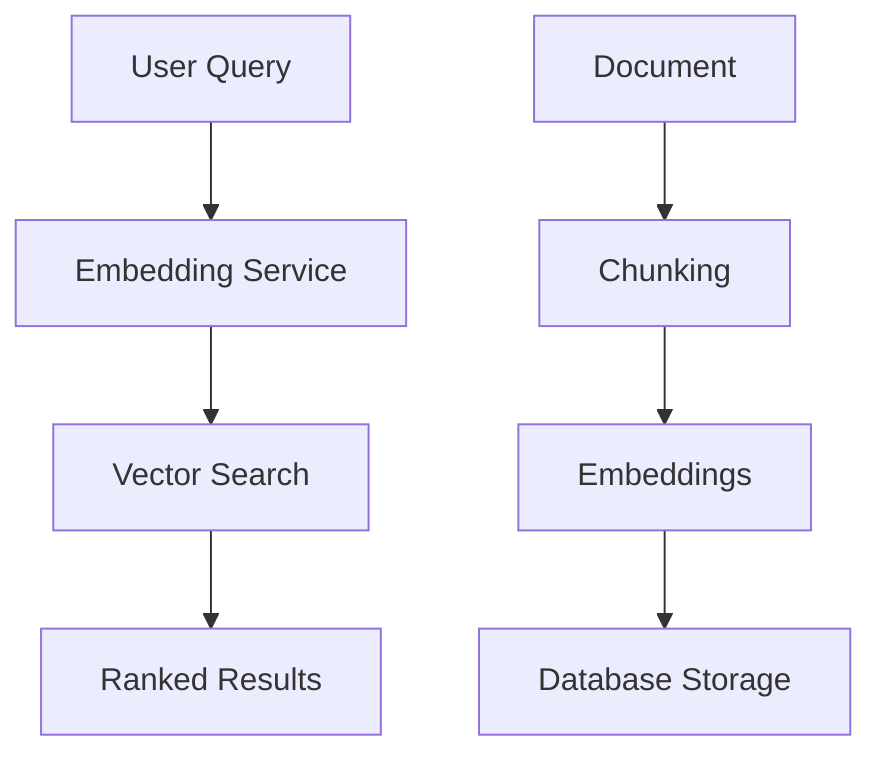

# Semantic Search for Financial 10-K Reports

A semantic search system built in Elixir that processes financial 10-K reports, stores them as vector embeddings, and enables natural language queries to find semantically similar document sections.

## Overview

This solution processes financial documents (Google and Meta 10-K reports) by:
1. **Chunking** documents into semantically meaningful pieces
2. **Generating embeddings** using sentence-transformers model
3. **Storing vectors** in PostgreSQL with pgvector extension
4. **Searching** using cosine similarity for semantic matching

## Project Structure

```
task/
├── data/markdown/          # Source 10-K documents
│   ├── goog-10-k.md        # Alphabet Inc. (Google) 10-K - 2024
│   └── meta-10-k.md        # Meta Platforms Inc. 10-K - 2022
├── otp_single.livemd    # Single GenServer approach
├── otp_batched.livemd   # Dynamic batching approach
├── otp_pool.livemd      # Worker pool approach
├── docker-compose.yml     # PostgreSQL + Livebook services
├── Makefile               # Development commands
└── README.md              # This documentation
```

## Architecture



### Key Components

- **Database**: PostgreSQL with pgvector extension for vector storage
- **Embedding Service**: Multiple OTP approaches for model management
- **Document Processor**: Handles chunking and batch embedding generation
- **Semantic Search**: Vector similarity search with cosine distance

## Features

- **Semantic Understanding**: Finds conceptually similar content, not just keyword matches
- **Multiple OTP Approaches**: Three different implementations demonstrating various concurrency patterns
- **Efficient Storage**: IVFFlat indexing for fast vector similarity search
- **Production Ready**: Proper error handling, timeouts, and database transactions

## Implementation Approaches

This project demonstrates three different OTP approaches for handling concurrent embedding generation:

### 1. Single GenServer Approach (`otp_single.livemd`)
- **Pattern**: Single GenServer with simple batching
- **Concurrency**: Sequential processing with fixed batch sizes
- **Use Case**: Simple, predictable workloads
- **Key Features**:
  - Single model instance shared across requests
  - Fixed batch size (16 chunks)
  - 30s timeout for individual requests
  - Straightforward error handling

### 2. Dynamic Batching Approach (`otp_batched.livemd`)
- **Pattern**: Single GenServer with intelligent batching
- **Concurrency**: Dynamic batching with time-based triggers
- **Use Case**: Variable workloads with latency optimization
- **Key Features**:
  - Queue-based request handling
  - Batch size limit (32) with timeout (50ms)
  - Automatic batch processing when full or timeout reached
  - Optimized for throughput vs latency trade-offs

### 3. Worker Pool Approach (`otp_pool.livemd`)
- **Pattern**: DynamicSupervisor with worker pool
- **Concurrency**: Multiple worker processes with load balancing
- **Use Case**: High-throughput, fault-tolerant processing
- **Key Features**:
  - DynamicSupervisor manages worker lifecycle
  - Pool of 3 embedding workers
  - Random load balancing across workers
  - Automatic worker recovery on failure
  - True parallelism for concurrent requests

## Solution Architecture

The system implements three different OTP approaches for handling concurrent embedding generation, each demonstrating different concurrency patterns and trade-offs:

### Database Schema
- **Documents Table**: Stores original 10-K reports with metadata
- **Document Chunks Table**: Stores text chunks with vector embeddings
- **Vector Indexing**: IVFFlat index for efficient cosine similarity search
- **Relationships**: Foreign key constraints maintain document-chunk associations

### Document Processing Pipeline
1. **Text Chunking**: Sentence-based splitting (5 sentences per chunk, 50 char minimum)
2. **Embedding Generation**: Uses sentence-transformers/all-MiniLM-L6-v2 model
3. **Vector Storage**: 384-dimensional embeddings stored in PostgreSQL with pgvector
4. **Indexing**: IVFFlat index for sub-linear similarity search performance
5. **Search**: Cosine similarity with distance-to-similarity conversion

### Concurrency Solutions

#### Single GenServer Approach
- **Pattern**: Traditional GenServer with sequential batch processing
- **State Management**: Single model instance shared across all requests
- **Request Handling**: Fixed batch size (16 chunks) with 30s timeout
- **Error Handling**: Simple error propagation with transaction rollback
- **Use Case**: Predictable workloads with consistent processing times

#### Dynamic Batching Approach
- **Pattern**: Queue-based GenServer with intelligent batching
- **State Management**: Request queue with timer-based batch triggers
- **Request Handling**: Batch size limit (32) with timeout (50ms) triggers
- **Performance**: Optimized for latency vs throughput trade-offs
- **Use Case**: Variable workloads requiring responsive processing

#### Worker Pool Approach
- **Pattern**: DynamicSupervisor with load-balanced worker processes
- **State Management**: Multiple model instances across worker processes
- **Request Handling**: Random load balancing across 3 workers
- **Fault Tolerance**: Automatic worker recovery on failure
- **Use Case**: High-throughput scenarios requiring true parallelism

### Semantic Search Implementation
- **Query Processing**: Natural language queries converted to vector embeddings
- **Similarity Calculation**: Cosine distance converted to similarity scores (0-1 range)
- **Result Ranking**: Results ordered by similarity with configurable limits
- **Context Preservation**: Document title and chunk index maintained for result context
- **Performance**: SQL-level vector operations with indexed similarity search

## Example Queries

The system includes comprehensive demo queries that showcase semantic understanding:

### Risk and Regulatory
- "What are the main risk factors mentioned?" → Returns risk factors and challenges
- "What regulatory challenges does the company face?" → Finds compliance and legal issues
- "What are the cybersecurity risks?" → Locates security-related concerns

### Financial Performance
- "How does the company generate revenue?" → Returns revenue and business model information
- "What are the financial performance metrics?" → Finds profitability and financial data

### Technology and Innovation
- "How is artificial intelligence being used?" → Locates AI and ML implementations
- "What technology risks exist?" → Finds tech-related challenges and dependencies

### Competition and Market
- "What are the competitive threats?" → Returns competitive landscape analysis
- "Tell me about competition" → Finds market positioning information

### Data and Privacy
- "How does the company handle data privacy?" → Returns privacy policies and GDPR compliance
- "What strategic acquisitions or partnerships are mentioned?" → Finds M&A and partnership information

### Environmental and Social
- "How does the company address environmental sustainability?" → Returns ESG initiatives

## Technical Decisions

### Core Technology Stack
- **Model**: all-MiniLM-L6-v2 (optimized for Q&A, 384 dimensions)
- **Database**: PostgreSQL with pgvector extension
- **Vector Storage**: IVFFlat indexing for sub-linear search complexity
- **Chunking**: Sentence-based splitting (5 sentences per chunk, 50 char minimum)
- **Similarity**: Cosine distance for normalized vector comparison

### Concurrency Patterns
- **Single GenServer**: Simple, predictable processing with fixed batching
- **Dynamic Batching**: Queue-based with time/size triggers for latency optimization
- **Worker Pool**: DynamicSupervisor with load balancing for high throughput

### Performance Optimizations
- **Batch Processing**: Configurable batch sizes (3-16 chunks per batch)
- **Database Pooling**: Connection pooling with queue management
- **Bulk Inserts**: `Repo.insert_all/3` for efficient chunk storage
- **Vector Indexing**: IVFFlat index for fast similarity search
- **Transaction Management**: Proper timeouts and error handling

## System Statistics

- **Vector Dimensions**: 384 (1.5 KB per embedding)
- **Indexing**: IVFFlat for sub-linear search complexity
- **Processing**: Batch embedding generation for efficiency
- **Search**: SQL-level vector operations for performance

## Task Requirements Addressed

### OTP Principles and Design Patterns
- **GenServer Pattern**: Multiple implementations demonstrating different GenServer usage patterns
- **DynamicSupervisor**: Worker pool approach shows proper supervision tree management
- **Process Isolation**: Each service runs in its own process with proper error handling
- **State Management**: Model loading and serving handled through GenServer state
- **Message Passing**: Asynchronous communication via `GenServer.call/3` with configurable timeouts
- **Supervision Strategies**: Different approaches to process lifecycle management

### Handling Multiple Requests at Once
- **Single GenServer**: Sequential processing with fixed batching for predictable behavior
- **Dynamic Batching**: Queue-based processing with intelligent batching for latency optimization
- **Worker Pool**: True parallelism with multiple workers and load balancing
- **Timeout Management**: Configurable timeouts (30s-60s) for different operation types
- **Non-blocking Operations**: Database operations use transactions to prevent blocking
- **Resource Sharing**: Efficient model instance sharing across different concurrency patterns

### Proper Document Splitting into Chunks
- **Semantic Preservation**: Sentence-based chunking (5 sentences) maintains meaning boundaries
- **Configurable Size**: Adjustable chunk sizes with minimum length validation (50 characters)
- **Content Filtering**: Rejects chunks shorter than minimum threshold
- **Index Tracking**: Each chunk maintains position information for document context
- **Relationship Mapping**: Foreign key relationships preserve document-chunk associations
- **Batch Processing**: Efficient processing of chunks in configurable batch sizes

### Model Optimized for Question & Answer Scenarios
- **Specialized Model**: `sentence-transformers/all-MiniLM-L6-v2` optimized for Q&A tasks
- **Semantic Understanding**: Captures conceptual relationships beyond keyword matching
- **Query Processing**: Handles natural language questions effectively across all approaches
- **Similarity Scoring**: Cosine similarity provides meaningful relevance ranking
- **Domain Adaptation**: Model performs well on financial and business language
- **Vector Dimensions**: 384-dimensional embeddings (1.5 KB per vector) for optimal performance

## Data Sources

The system processes real 10-K financial reports:

- **Alphabet Inc. (Google) 10-K - 2024** (`goog-10-k.md`)
  - Comprehensive annual report covering business operations, risks, and financial performance
  - Includes sections on AI, cloud computing, advertising, and regulatory challenges
- **Meta Platforms Inc. 10-K - 2022** (`meta-10-k.md`)
  - Detailed financial and business information for Meta's social media and metaverse initiatives
  - Covers privacy regulations, competition, and technology investments

Both documents are processed into semantic chunks for comprehensive search capabilities.

## Future Enhancements

- Larger financial-domain models for better accuracy
- Hybrid search combining semantic and keyword matching
- Caching for frequent queries
- Horizontal scaling with multiple embedding services

### Possible improvements

**Telemetry**:

```elixir
defmodule SentenceTransformer.Telemetry.Setup do
  require Logger

  def attach_handlers do
    events = [
      [:sentence_transformer, :embedding, :generation],
      [:sentence_transformer, :batch, :processing],
      [:sentence_transformer, :database, :query],
      [:sentence_transformer, :cache, :hit],
      [:sentence_transformer, :cache, :miss],
      [:sentence_transformer, :circuit_breaker, :state_change]
    ]

    :telemetry.attach_many(
      "sentence-transformer-handler",
      events,
      &handle_event/4,
      nil
    )
  end

  defp handle_event([:sentence_transformer, :embedding, :generation] = event, measurements, metadata, _) do
    Logger.info("Embedding generated",
      duration_ms: measurements.duration / 1_000_000,
      text_length: metadata.text_length,
      batch_size: metadata[:batch_size] || 1
    )

    # Prometheus metrics
    :prometheus_histogram.observe(
      :embedding_generation_duration_ms,
      measurements.duration / 1_000_000
    )
  end
end
```

**Backpressure handling**:

```elixir
defmodule SentenceTransformer.BatchingEmbeddingService do
  @max_queue_size 1000

  def handle_call({:get_embedding, text}, from, state) do
    if length(state.batch_queue) >= @max_queue_size do
      {:reply, {:error, :overloaded}, state}
    else
      # ...
    end
  end
end
```

**Circuit breaker**:

```elixir
defmodule SentenceTransformer.CircuitBreaker do
  use GenServer

  @failure_threshold 5
  @reset_timeout 60_000

  def call(fun),
    do: GenServer.call(__MODULE__, {:call, fun})

  def handle_call({:call, fun}, _from, %{state: :open} = state) do
    if :os.system_time(:millisecond) - state.opened_at > @reset_timeout do
      {:reply, execute_with_monitoring(fun), %{state | state: :half_open}}
    else
      {:reply, {:error, :circuit_open}, state}
    end
  end

  # ...
end
```
